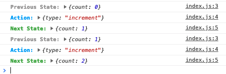

# use-reducer-logger
A very very basic logger for the `useReducer` function in the [React Hooks API](https://reactjs.org/docs/hooks-reference.html#usereducer). Inspired by [redux-logger](https://github.com/LogRocket/redux-logger).



# Usage
1. Install with `npm install use-reducer-logger --save-dev` or `yarn add use-reducer-logger -D`
2. Import logger with

```javascript
import logger from 'use-reducer-logger';
```

3. Wrap your reducer with logger before passing it to `useReducer`

```javascript
const [state, dispatch] = useReducer(logger(reducer), initialState);
```

See [Example](https://github.com/jefflombard/use-reducer-logger-example)

## In a Dev Environment
You should only use this in a `dev` environment. So you could do something like this to apply the logger based on the `env`.

```javascript
function reducer(state, action) {
  switch (action.type) {
    case 'increment':
      return {count: state.count + 1};
    case 'decrement':
      return {count: state.count - 1};
    default:
      throw new Error();
  }
}

const [state, dispatch] = (
  process.env.NODE_ENV === 'development' ? logger(reducer) : reducer,
  initialState
);
```

# License
MIT see [`LICENSE`](/LICENSE).

# Contributing
Contributions are welcome.
